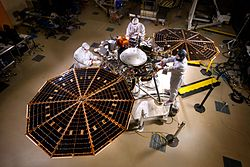
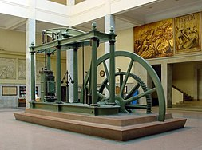

<table class="vertical-navbox nowraplinks">
<tbody>
<tr>
<th><a class="mw-selflink selflink">Engineering</a></th>
</tr>
<tr>
<td>

<ul>
<li><a title="History of engineering" href="https://en.wikipedia.org/wiki/History_of_engineering">History</a></li>
<li><a title="Outline of engineering" href="https://en.wikipedia.org/wiki/Outline_of_engineering">Outline</a></li>
<li><a title="Glossary of engineering" href="https://en.wikipedia.org/wiki/Glossary_of_engineering">Glossary</a></li>
<li><a title="Category:Engineering" href="https://en.wikipedia.org/wiki/Category:Engineering">Category</a></li>
<li><a title="Portal:Engineering" href="https://en.wikipedia.org/wiki/Portal:Engineering">Portal</a></li>
</ul>

</td>
</tr>
</tbody>
</table>

&nbsp;

&nbsp;

The&nbsp;<em><a title="InSight" href="https://en.wikipedia.org/wiki/InSight">InSight</a></em>&nbsp;lander with solar panels deployed in a cleanroom

&nbsp;

&nbsp;

&nbsp;

The&nbsp;<a title="Steam engine" href="https://en.wikipedia.org/wiki/Steam_engine">steam engine</a>, the major driver in the&nbsp;<a title="Industrial Revolution" href="https://en.wikipedia.org/wiki/Industrial_Revolution">Industrial Revolution</a>, underscores the importance of engineering in modern history. This&nbsp;<a title="Beam engine" href="https://en.wikipedia.org/wiki/Beam_engine">beam engine</a>&nbsp;is on display in the&nbsp;<a title="Technical University of Madrid" href="https://en.wikipedia.org/wiki/Technical_University_of_Madrid">Technical University of Madrid</a>.

&nbsp;

 

<strong>Engineering</strong>&nbsp;is the use of&nbsp;<a title="Scientific method" href="https://en.wikipedia.org/wiki/Scientific_method">scientific principles</a>&nbsp;to design and build machines, structures, and other items, including bridges, tunnels, roads, vehicles, and buildings.&nbsp;The discipline of engineering encompasses a broad range of more specialized&nbsp;<a title="List of engineering branches" href="https://en.wikipedia.org/wiki/List_of_engineering_branches">fields of engineering</a>, each with a more specific emphasis on particular areas of&nbsp;<a title="Applied mathematics" href="https://en.wikipedia.org/wiki/Applied_mathematics">applied mathematics</a>,&nbsp;<a title="Applied science" href="https://en.wikipedia.org/wiki/Applied_science">applied science</a>, and types of application. See&nbsp;<a title="Glossary of engineering" href="https://en.wikipedia.org/wiki/Glossary_of_engineering">glossary of engineering</a>.

The term&nbsp;<em>engineering</em>&nbsp;is derived from the&nbsp;<a title="Latin" href="https://en.wikipedia.org/wiki/Latin">Latin</a>&nbsp;<em>ingenium</em>, meaning "cleverness" and&nbsp;<em>ingeniare</em>, meaning "to contrive, devise".

 

<h2> Books</h2>

<ul>

                             

 <li><a target="_blank" href="https://github.com/manjunath5496/Engineering-Books/blob/master/enb(1).pdf" style="text-decoration:none;">A Textbook of Engineering Mechanics </a></li>

 <li><a target="_blank" href="https://github.com/manjunath5496/Engineering-Books/blob/master/enb(2).pdf" style="text-decoration:none;">Thermodynamics: An Engineering Approach</a></li>

<li><a target="_blank" href="https://github.com/manjunath5496/Engineering-Books/blob/master/enb(3).pdf" style="text-decoration:none;">Engineering for Structural Stability in Bridge Construction</a></li>
 <li><a target="_blank" href="https://github.com/manjunath5496/Engineering-Books/blob/master/enb(4).pdf" style="text-decoration:none;">Fundamentals of Chemical Reaction Engineering</a></li>                              
<li><a target="_blank" href="https://github.com/manjunath5496/Engineering-Books/blob/master/enb(5).pdf" style="text-decoration:none;">iOS App Reverse Engineering</a></li>
<li><a target="_blank" href="https://github.com/manjunath5496/Engineering-Books/blob/master/enb(6).pdf" style="text-decoration:none;">Chemical Reaction Engineering</a></li>
 <li><a target="_blank" href="https://github.com/manjunath5496/Engineering-Books/blob/master/enb(7).pdf" style="text-decoration:none;">Higher Engineering Mathematics</a></li>

 <li><a target="_blank" href="https://github.com/manjunath5496/Engineering-Books/blob/master/enb(8).pdf" style="text-decoration:none;"> Wood Handbook: Wood as an Engineering Material </a></li>
                              
 <li><a target="_blank" href="https://github.com/manjunath5496/Engineering-Books/blob/master/enb(10).pdf" style="text-decoration:none;">NASA Systems Engineering Handbook </a></li>                              
<li><a target="_blank" href="https://github.com/manjunath5496/Engineering-Books/blob/master/enb(11).pdf" style="text-decoration:none;">Modeling Tools for Environmental Engineers and Scientists</a></li>
<li><a target="_blank" href="https://github.com/manjunath5496/Engineering-Books/blob/master/enb(12).pdf" style="text-decoration:none;">Aquaculture Engineering</a></li>
<li><a target="_blank" href="https://github.com/manjunath5496/Engineering-Books/blob/master/enb(13).pdf" style="text-decoration:none;">Engineering rock mechanics: part 2</a></li>
                              
<li><a target="_blank" href="https://github.com/manjunath5496/Engineering-Books/blob/master/enb(14).pdf" style="text-decoration:none;">Digital Logic And Computer Design</a></li>
<li><a target="_blank" href="https://github.com/manjunath5496/Engineering-Books/blob/master/enb(15).pdf" style="text-decoration:none;">Solutions Manuals - Elements Of Chemical Reaction Engineering</a></li>

<li><a target="_blank" href="https://github.com/manjunath5496/Engineering-Books/blob/master/enb(16).pdf" style="text-decoration:none;">Environmental engineering</a></li>

  <li><a target="_blank" href="https://github.com/manjunath5496/Engineering-Books/blob/master/enb(17).pdf" style="text-decoration:none;">An Introduction to Mechanical Engineering</a></li>   
  
<li><a target="_blank" href="https://github.com/manjunath5496/Engineering-Books/blob/master/enb(18).pdf" style="text-decoration:none;">Game Engine Architecture</a></li> 
<li><a target="_blank" href="https://github.com/manjunath5496/Engineering-Books/blob/master/enb(19).pdf" style="text-decoration:none;">Liquid Explosives</a></li> 

<li><a target="_blank" href="https://github.com/manjunath5496/Engineering-Books/blob/master/enb(20).pdf" style="text-decoration:none;">Pile Design and Construction Practice </a></li>

<li><a target="_blank" href="https://github.com/manjunath5496/Engineering-Books/blob/master/enb(21).pdf" style="text-decoration:none;">Fundamentals of Materials Science and Engineering: An Interactive e Text</a></li>
<li><a target="_blank" href="https://github.com/manjunath5496/Engineering-Books/blob/master/enb(22).pdf" style="text-decoration:none;">Mathematical And Numerical Modeling In Geotechnical Engineering</a></li> 
 
 

   <li><a target="_blank" href="https://github.com/manjunath5496/Engineering-Books/blob/master/enb(24).pdf" style="text-decoration:none;">Bridge to Abstract Mathematics: Mathematical Proof and Structures</a></li>
 
   <li><a target="_blank" href="https://github.com/manjunath5496/Engineering-Books/blob/master/enb(25).pdf" style="text-decoration:none;">Autodesk 3ds Max: Animation Tutorials</a></li>                              
 <li><a target="_blank" href="https://github.com/manjunath5496/Engineering-Books/blob/master/enb(26).pdf" style="text-decoration:none;">Mechanical Engineering Drawing Workshop</a></li>
  <li><a target="_blank" href="https://github.com/manjunath5496/Engineering-Books/blob/master/enb(27).pdf" style="text-decoration:none;">Engineering Economy</a></li>
   
 
   <li><a target="_blank" href="https://github.com/manjunath5496/Engineering-Books/blob/master/enb(28).pdf" style="text-decoration:none;">Reversing: Secrets of Reverse Engineering </a></li>
 
   <li><a target="_blank" href="https://github.com/manjunath5496/Engineering-Books/blob/master/enb(29).pdf" style="text-decoration:none;">Hydraulic Structures </a></li>                              

  <li><a target="_blank" href="https://github.com/manjunath5496/Engineering-Books/blob/master/enb(30).pdf" style="text-decoration:none;">Fundamentals of Biochemical Engineering</a></li>
 
   <li><a target="_blank" href="https://github.com/manjunath5496/Engineering-Books/blob/master/enb(31).pdf" style="text-decoration:none;">Advanced Unsaturated Soil Mechanics and Engineering</a></li> 
    <li><a target="_blank" href="https://github.com/manjunath5496/Engineering-Books/blob/master/enb(32).pdf" style="text-decoration:none;">PLC-based Process Control Engineering Guide</a></li> 

                   
  <li><a target="_blank" href="https://github.com/manjunath5496/Engineering-Books/blob/master/enb(34).pdf" style="text-decoration:none;">Machine Drawing</a></li> 
 
  <li><a target="_blank" href="https://github.com/manjunath5496/Engineering-Books/blob/master/enb(35).pdf" style="text-decoration:none;">Architectural and Engineering Design Standards</a></li> 
  
 
<li><a target="_blank" href="https://github.com/manjunath5496/Engineering-Books/blob/master/enb(37).pdf" style="text-decoration:none;">Fundamentals Of Reservoir Engineering</a></li>
 <li><a target="_blank" href="https://github.com/manjunath5496/Engineering-Books/blob/master/enb(38).pdf" style="text-decoration:none;">Geotechnical Engineering</a></li>
<li><a target="_blank" href="https://github.com/manjunath5496/Engineering-Books/blob/master/enb(39).pdf" style="text-decoration:none;">Practical MATLAB: Applications For Engineers</a></li>
 <li><a target="_blank" href="https://github.com/manjunath5496/Engineering-Books/blob/master/enb(40).pdf" style="text-decoration:none;">Introduction to SolidWorks</a></li>                              
<li><a target="_blank" href="https://github.com/manjunath5496/Engineering-Books/blob/master/enb(41).pdf" style="text-decoration:none;">Handbook of Networked and Embedded Control Systems</a></li>
<li><a target="_blank" href="https://github.com/manjunath5496/Engineering-Books/blob/master/enb(42).pdf" style="text-decoration:none;">Understanding Engineering Mathematics </a></li>
 
  <li><a target="_blank" href="https://github.com/manjunath5496/Engineering-Books/blob/master/enb(43).pdf" style="text-decoration:none;">Principles Of Bioseparations Engineering</a></li>
 <li><a target="_blank" href="https://github.com/manjunath5496/Engineering-Books/blob/master/enb(44).pdf" style="text-decoration:none;">Performance-based Plastic Design Of Seismic Resistant Special Truss Moment Frames </a></li>
   <li><a target="_blank" href="https://github.com/manjunath5496/Engineering-Books/blob/master/enb(45).pdf" style="text-decoration:none;">Modern Control Engineering</a></li>
                            
<li><a target="_blank" href="https://github.com/manjunath5496/Engineering-Books/blob/master/enb(46).pdf" style="text-decoration:none;">Object-Oriented and Classical Software Engineering</a></li>

<li><a target="_blank" href="https://github.com/manjunath5496/Engineering-Books/blob/master/enb(47).pdf" style="text-decoration:none;">Engineering Surveying</a></li>

<li><a target="_blank" href="https://github.com/manjunath5496/Engineering-Books/blob/master/enb(48).pdf" style="text-decoration:none;">Audio Engineering </a></li>
                              
<li><a target="_blank" href="https://github.com/manjunath5496/Engineering-Books/blob/master/enb(49).pdf" style="text-decoration:none;">ANSYS Mechanical APDL Structural Analysis Guide</a></li>
<li><a target="_blank" href="https://github.com/manjunath5496/Engineering-Books/blob/master/enb(50).pdf" style="text-decoration:none;">Engineering Thermodynamics </a></li>

<li><a target="_blank" href="https://github.com/manjunath5496/Engineering-Books/blob/master/enb(51).pdf" style="text-decoration:none;">Chemical Thermodynamics of Materials: Macroscopic and Microscopic Aspects </a></li>

<li><a target="_blank" href="https://github.com/manjunath5496/Engineering-Books/blob/master/enb(52).pdf" style="text-decoration:none;">Physics and Engineering of Radiation Detection</a></li>

<li><a target="_blank" href="https://github.com/manjunath5496/Engineering-Books/blob/master/enb(53).pdf" style="text-decoration:none;">Advanced Methods of Structural Analysis</a></li>

<li><a target="_blank" href="https://github.com/manjunath5496/Engineering-Books/blob/master/enb(54).pdf" style="text-decoration:none;">A Guide to Physics Problems: Part 2: Thermodynamics, Statistical Physics, and Quantum Mechanics </a></li>

<li><a target="_blank" href="https://github.com/manjunath5496/Engineering-Books/blob/master/enb(55).pdf" style="text-decoration:none;">Engineering Analysis with SolidWorks Simulation 2011  </a></li>

<li><a target="_blank" href="https://github.com/manjunath5496/Engineering-Books/blob/master/enb(56).pdf" style="text-decoration:none;">Hysys: An Introduction to Chemical Engineering Simulation</a></li>

<li><a target="_blank" href="https://github.com/manjunath5496/Engineering-Books/blob/master/enb(57).pdf" style="text-decoration:none;">Basic Engineering Mathematics  </a></li>

<li><a target="_blank" href="https://github.com/manjunath5496/Engineering-Books/blob/master/enb(58).pdf" style="text-decoration:none;">Piping Materials: selection and applications  </a></li>

 <li><a target="_blank" href="https://github.com/manjunath5496/Engineering-Books/blob/master/enb(59).pdf" style="text-decoration:none;">Engineering Thermodynamics of Thermal Radiation: For Solar Power Utilization </a></li>

 <li><a target="_blank" href="https://github.com/manjunath5496/Engineering-Books/blob/master/enb(60).pdf" style="text-decoration:none;">Web engineering: principles and techniques</a></li>

<li><a target="_blank" href="https://github.com/manjunath5496/Engineering-Books/blob/master/enb(61).pdf" style="text-decoration:none;">Engineering Drawing</a></li>
 <li><a target="_blank" href="https://github.com/manjunath5496/Engineering-Books/blob/master/enb(62).pdf" style="text-decoration:none;">Engineering Fluid Mechanics</a></li>                              
<li><a target="_blank" href="https://github.com/manjunath5496/Engineering-Books/blob/master/enb(63).pdf" style="text-decoration:none;">Engineering Mechanics And Drawing (Electrical Machines and Appliances) </a></li>
<li><a target="_blank" href="https://github.com/manjunath5496/Engineering-Books/blob/master/enb(64).pdf" style="text-decoration:none;">Orbital Mechanics for Engineering Students</a></li>
 <li><a target="_blank" href="https://github.com/manjunath5496/Engineering-Books/blob/master/enb(65).pdf" style="text-decoration:none;">An Introduction to Aircraft Structural Analysis</a></li>

 <li><a target="_blank" href="https://github.com/manjunath5496/Engineering-Books/blob/master/enb(66).pdf" style="text-decoration:none;"> Object-Oriented Software Engineering: Practical software development using UML and Java </a></li>
                              
 <li><a target="_blank" href="https://github.com/manjunath5496/Engineering-Books/blob/master/enb(67).pdf" style="text-decoration:none;">Learning RSLogix 5000 Programming </a></li>                              
<li><a target="_blank" href="https://github.com/manjunath5496/Engineering-Books/blob/master/enb(68).pdf" style="text-decoration:none;">Engineering Optimization</a></li>
<li><a target="_blank" href="https://github.com/manjunath5496/Engineering-Books/blob/master/enb(69).pdf" style="text-decoration:none;">High Voltage Engineering</a></li>
<li><a target="_blank" href="https://github.com/manjunath5496/Engineering-Books/blob/master/enb(70).pdf" style="text-decoration:none;">Groundwork and Civil Engineering</a></li>
                              
<li><a target="_blank" href="https://github.com/manjunath5496/Engineering-Books/blob/master/enb(71).pdf" style="text-decoration:none;">Highway Engineering</a></li>
<li><a target="_blank" href="https://github.com/manjunath5496/Engineering-Books/blob/master/enb(72).pdf" style="text-decoration:none;">ANSYS Mechanical APDL Basic Analysis Guide</a></li>

<li><a target="_blank" href="https://github.com/manjunath5496/Engineering-Books/blob/master/enb(73).pdf" style="text-decoration:none;">Software Engineering: Principles and Practice</a></li>

  <li><a target="_blank" href="https://github.com/manjunath5496/Engineering-Books/blob/master/enb(74).pdf" style="text-decoration:none;">Statistical Thermodynamics: Fundamentals and Applications</a></li>   
  
<li><a target="_blank" href="https://github.com/manjunath5496/Engineering-Books/blob/master/enb(75).pdf" style="text-decoration:none;">Digital Control Engineering: Analysis and Design</a></li> 
<li><a target="_blank" href="https://github.com/manjunath5496/Engineering-Books/blob/master/enb(77).pdf" style="text-decoration:none;">Civil Engineering Formulas</a></li> 

<li><a target="_blank" href="https://github.com/manjunath5496/Engineering-Books/blob/master/enb(78).pdf" style="text-decoration:none;">Risk and Safety in Civil Engineering </a></li>

<li><a target="_blank" href="https://github.com/manjunath5496/Engineering-Books/blob/master/enb(79).pdf" style="text-decoration:none;">Numerical Methods for Chemical Engineering</a></li>
<li><a target="_blank" href="https://github.com/manjunath5496/Engineering-Books/blob/master/enb(80).pdf" style="text-decoration:none;">Handbook of Electrical Engineering</a></li> 
 
 

   <li><a target="_blank" href="https://github.com/manjunath5496/Engineering-Books/blob/master/enb(81).pdf" style="text-decoration:none;">Computer Aided Engineering Design</a></li>
 
   <li><a target="_blank" href="https://github.com/manjunath5496/Engineering-Books/blob/master/enb(82).pdf" style="text-decoration:none;">Electric Power Engineering Handbook</a></li>                              
 <li><a target="_blank" href="https://github.com/manjunath5496/Engineering-Books/blob/master/enb(83).pdf" style="text-decoration:none;">Control Engineering</a></li>
  <li><a target="_blank" href="https://github.com/manjunath5496/Engineering-Books/blob/master/enb(84).pdf" style="text-decoration:none;">AutoCAD LT 2011: Customization Guide</a></li>
   
 
   <li><a target="_blank" href="https://github.com/manjunath5496/Engineering-Books/blob/master/enb(85).pdf" style="text-decoration:none;">Engineering Design with SOLIDWORKS 2016 and Video Instruction </a></li>
 
   <li><a target="_blank" href="https://github.com/manjunath5496/Engineering-Books/blob/master/enb(87).pdf" style="text-decoration:none;">Advanced Natural Gas Engineering </a></li>                              

  <li><a target="_blank" href="https://github.com/manjunath5496/Engineering-Books/blob/master/enb(88).pdf" style="text-decoration:none;">Power Plant Engineering</a></li>
 
   <li><a target="_blank" href="https://github.com/manjunath5496/Engineering-Books/blob/master/enb(90).pdf" style="text-decoration:none;">Engineering Maintenance: A Modern Approach</a></li> 
    <li><a target="_blank" href="https://github.com/manjunath5496/Engineering-Books/blob/master/enb(91).pdf" style="text-decoration:none;">Financial Engineering Principles: A Unified Theory for Financial Product Analysis and Valuation</a></li> 

                   
  <li><a target="_blank" href="https://github.com/manjunath5496/Engineering-Books/blob/master/enb(92).pdf" style="text-decoration:none;">Flight Dynamics Principles</a></li> 
 
  <li><a target="_blank" href="https://github.com/manjunath5496/Engineering-Books/blob/master/enb(93).pdf" style="text-decoration:none;">Fundamentals of Probability and Statistics for Engineers</a></li> 
  
 
<li><a target="_blank" href="https://github.com/manjunath5496/Engineering-Books/blob/master/enb(94).pdf" style="text-decoration:none;">Fundamentals of Thermodynamics</a></li>
 <li><a target="_blank" href="https://github.com/manjunath5496/Engineering-Books/blob/master/enb(95).pdf" style="text-decoration:none;">Chemical Engineering Thermodynamics II</a></li>
<li><a target="_blank" href="https://github.com/manjunath5496/Engineering-Books/blob/master/enb(96).pdf" style="text-decoration:none;">Thermodynamics Demystified</a></li>
 <li><a target="_blank" href="https://github.com/manjunath5496/Engineering-Books/blob/master/enb(97).pdf" style="text-decoration:none;">Mechanical Engineering Principles</a></li>                              
<li><a target="_blank" href="https://github.com/manjunath5496/Engineering-Books/blob/master/enb(98).pdf" style="text-decoration:none;">Lecture Notes: Structural Concepts and Systems for Architects</a></li>
<li><a target="_blank" href="https://github.com/manjunath5496/Engineering-Books/blob/master/enb(99).pdf" style="text-decoration:none;">Fundamentals of Electrical Engineering I </a></li>
 
  <li><a target="_blank" href="https://github.com/manjunath5496/Engineering-Books/blob/master/enb(100).pdf" style="text-decoration:none;">Engineering Ethics: Concepts and Cases</a></li>
 <li><a target="_blank" href="https://github.com/manjunath5496/Engineering-Books/blob/master/enb(101).pdf" style="text-decoration:none;">Solution Manuals Of Advanced Engineering Mathematics </a></li>
   <li><a target="_blank" href="https://github.com/manjunath5496/Engineering-Books/blob/master/enb(103).pdf" style="text-decoration:none;">Essentials of Chemical Reaction Engineering</a></li>
                            
<li><a target="_blank" href="https://github.com/manjunath5496/Engineering-Books/blob/master/enb(104).pdf" style="text-decoration:none;">Chemical Engineering: Solutions To The Problems In Chemical Engineering Volume 1</a></li>

<li><a target="_blank" href="https://github.com/manjunath5496/Engineering-Books/blob/master/enb(105).pdf" style="text-decoration:none;">The Engineer: Follow Elon Musk on a journey from South Africa to Mars</a></li>

<li><a target="_blank" href="https://github.com/manjunath5496/Engineering-Books/blob/master/enb(106).pdf" style="text-decoration:none;">Environmental Engineering Dictionary and Directory </a></li>
                              
<li><a target="_blank" href="https://github.com/manjunath5496/Engineering-Books/blob/master/enb(107).pdf" style="text-decoration:none;">Fundamentals of Chemical Engineering Thermodynamics</a></li>
<li><a target="_blank" href="https://github.com/manjunath5496/Engineering-Books/blob/master/enb(108).pdf" style="text-decoration:none;">Software Engineering: Theory and Practice </a></li>

<li><a target="_blank" href="https://github.com/manjunath5496/Engineering-Books/blob/master/enb(9).pdf" style="text-decoration:none;">Textbook of Engineering Drawing</a></li>

<li><a target="_blank" href="https://github.com/manjunath5496/Engineering-Books/blob/master/enb(36).pdf" style="text-decoration:none;">The Hitchhiker's Guide to Python: Best Practices for Development</a></li>

<li><a target="_blank" href="https://github.com/manjunath5496/Engineering-Books/blob/master/enb(86).pdf" style="text-decoration:none;">So, You Wanna Be an Embedded Engineer </a></li>
                              
<li><a target="_blank" href="https://github.com/manjunath5496/Engineering-Books/blob/master/enb(102).pdf" style="text-decoration:none;">Basic Electronics for Scientists and Engineers</a></li>
<li><a target="_blank" href="https://github.com/manjunath5496/Engineering-Books/blob/master/enb(23).pdf" style="text-decoration:none;">Compiler Building Tutorial </a></li>

<li><a target="_blank" href="https://github.com/manjunath5496/Engineering-Books/blob/master/enb(33).pdf" style="text-decoration:none;">The Little Book of Semaphores </a></li>

<li><a target="_blank" href="https://github.com/manjunath5496/Engineering-Books/blob/master/enb(89).pdf" style="text-decoration:none;">Engineering Fundamentals of the Internal Combustion Engine </a></li>

<li><a target="_blank" href="https://github.com/manjunath5496/Engineering-Books/blob/master/enb(109).pdf" style="text-decoration:none;">Soil-structure interaction: The real behaviour of structures</a></li>
<li><a target="_blank" href="https://github.com/manjunath5496/Engineering-Books/blob/master/enb(110).pdf" style="text-decoration:none;">Basic Civil Engineering </a></li>

<li><a target="_blank" href="https://github.com/manjunath5496/Engineering-Books/blob/master/enb(111).pdf" style="text-decoration:none;">Introduction to Engineering for Electrical and Computer Engineering Students </a></li>

<li><a target="_blank" href="https://github.com/manjunath5496/Engineering-Books/blob/master/enb(112).pdf" style="text-decoration:none;">Plumbing Engineering Design Handbook </a></li>

<li><a target="_blank" href="https://github.com/manjunath5496/Engineering-Books/blob/master/enb(113).pdf" style="text-decoration:none;">Engineering Geology </a></li>

</ul>
